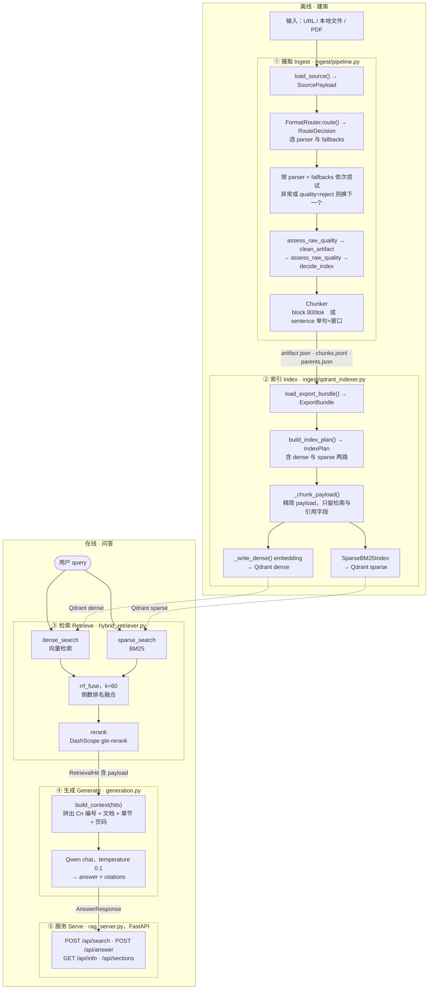

# 全链路流程图

从原始输入到答案引用的完整链路。分**离线（建库）**与**在线（问答）**两段。



---

## 各阶段的数据契约

### ① 摄取

| | |
|---|---|
| **入口** | `IngestPipeline.ingest(value, ...)` |
| **消费** | URL 字符串 / 本地文件路径 |
| **产出** | `IngestResult{artifact, route, attempts, parents, chunks}` |

关键步骤：

```text
load_source()            URL 抓取或读本地文件 → SourcePayload
                         （含 data / mime_type / local_path / sha256）
FormatRouter.route()     MIME + magic bytes + 后缀 → RouteDecision
                         RouteDecision 带 parser 与 fallbacks 链
parser 尝试循环          candidates = [route.parser] + route.fallbacks
                         抛异常 或 quality.status == "reject" → 换下一个
assess_raw_quality()     长度 / 重复率 / 有效内容比 → QualityReport
clean_artifact()         去噪（页眉页脚残留、重复行）
assess_raw_quality()     清理后复评
decide_index()           → IndexDecision{tier, dense_index, sparse_index, ...}
Chunker                  block 模式 或 sentence 模式
```

**注意**：`low` 不触发回退，只有 `reject` 才换 parser（`pipeline.py:74`）。

### ② 索引

| | |
|---|---|
| **入口** | `qdrant_indexer.py :: main()` |
| **消费** | 导出目录（`artifact.json` + `chunks.jsonl`） |
| **产出** | 两个 Qdrant collection：dense + sparse |

```text
load_export_bundle()     读产物 → ExportBundle{artifact, chunks, parent_count}
build_index_plan()       遍历 chunks → IndexPlan{dense: [(point_id, text, payload)], sparse: [...]}
  _chunk_payload()       构建存进向量库的 payload（只留检索与引用字段）
  dense_text/sparse_text 从 chunk 直读（不再经 payload，见 code_health_audit.md）
_write_dense()           embedding API → Qdrant dense collection
SparseBM25Index          BM25 索引
store_sparse_collection  → Qdrant sparse collection
```

**point_id 的推导**（重要）：

```python
point_id = blake2b(chunk_id.encode()) & (2**63 - 1)
```

所以 `chunk_id` 一变，`point_id` 就变 —— 这是旧 qrels 失效的原因。

### ③ 检索

| | |
|---|---|
| **入口** | `HybridRetriever.dense_search / sparse_search / rrf_fuse` |
| **消费** | query 字符串 + candidate_k |
| **产出** | `RetrievalHit[]`（含完整 payload） |

```text
dense_search(q, k)       query → embedding → Qdrant 向量检索
sparse_search(q, k)      query → jieba 分词 → BM25 → 含 unknown_terms
rrf_fuse(..., k=60)      倒数排名融合，两路等权
rerank                    DashScope gte-rerank 重排取 top-k
```

**分阶段评估**就是在这四步各取一次结果（`eval/run_eval.py`），
看每层带来多少增量。

### ④ 生成

| | |
|---|---|
| **入口** | `QwenChatGenerator.generate(query, hits)` |
| **消费** | `RetrievalHit[]` |
| **产出** | `GenerationResult{answer, citations, context_chars, model}` |

```text
build_context(hits)      按 context_source 取正文（text / window / auto）
                         拼 [Cn] 文档 | 章节 | 第 N 页 作为 header
                         同时构建 Citation（引用信息来自 payload）
Qwen chat                temperature 0.1，只能依据上下文作答
```

**引用信息不进 embedding** —— `page` / `bbox` / `section_path` 只在 payload 里，
`dense_text` 只含正文。这样向量是纯语义的。

### ⑤ 服务

| | |
|---|---|
| **入口** | `rag_server.py`（FastAPI） |
| **端点** | `POST /api/search`、`POST /api/answer`、`GET /api/info`、`GET /api/sections` |

`/api/answer` 的完整流程（`rag_server.py:310`）：

```text
_retrieve_with_rerank()  → hits + 各段耗时
generator.generate()     → answer + citations
_to_hit()                → Hit 模型（暴露 page / bbox / section_path / window_text）
返回 AnswerResponse      含 retrieval_ms / generation_ms / rerank_applied
```

---

## 离线与在线的边界

```text
离线（建库，可重复跑）        在线（请求时执行）
─────────────────────       ─────────────────────
① 摄取                       ③ 检索
② 索引                       ④ 生成
                             ⑤ 服务

边界产物: 导出目录 + Qdrant collection
```

**为什么这个边界重要**：改 parser / 改分块粒度属于离线侧，必须**重建索引**；
而改融合权重 / 重排策略属于在线侧，**不用重建**。

---

## 两处容易搞混的地方

**① 有两个"切块"概念**

```text
Block        parser 的产出（DocumentBlock），文档结构的原子单元
Chunk        检索单元（IndexReadyChunk），由 Block 切分而来
```

一个 Block 可能进多个 Chunk（overlap 导致），所以评估时 gold 是 chunk_id 的**集合**。

**② Markdown 中转层已移除（2026-09-18）**

原实现是所有 parser 都先转 Markdown 再进 `parse_markdown_text()`，导致
Block 的表达力上限 = Markdown 的表达力。现已改为各格式直产 Block：

| parser | 产出路径 | 说明 |
|---|---|---|
| `markdown` | 经 `parse_markdown_text` | 原生格式，本就该如此 |
| `plain_text` | **直产 Block** | 原误用 Markdown 解析器，`#` 行会变成标题 |
| `html_readability` | **直产 Block** | 从 DOM 构造，保留 href / 代码语言 / figcaption |
| `pdf_pdfplumber` | **直产 Block** | 能拿 page / bbox / 字号 / 原生大纲 |
| `pdf_pymupdf` | **直产 Block** | 同上（AGPL 备选） |
| ~~`pdf_mineru`~~ | ~~经 `parse_markdown_text`~~ | **已于 2026-09-20 移除**，见下 |

`parse_markdown_text` 现在**只服务真正的 Markdown 输入（`.md`）**，
不再充当"通用块化原语"，也不再有任何格式经它中转。

**`pdf_mineru` 为什么被移除（2026-09-20）**

它曾是唯一经 Markdown 中转的 PDF 路径（`PDF → Markdown → Block`）。
移除理由：

```text
① Markdown 表达不了页码/坐标/字号 —— 这些信息在进入 Block 前就永久丢失
   实测其产物 font_size 全为 null
② heading 层级不可信
   实测只剩 lv1/lv2（MinerU 把 lv3/lv4 压平），见 issues/11
③ 依赖外部 CLI `mineru-open-api`（需单独安装），flash-extract 还有 20 页上限
```

> 历史说明：早期文档曾论证"MinerU 的原生输出就是 Markdown，不算中转"。
> 该论证只回答了"是否多了一层转换"，没有回答"结构信息是否丢失" ——
> 而后者才是移除 Markdown 层的真正动机。②③ 两条实测证据推翻了该论证。

**为什么这件事重要**：Markdown 表达不了页码、坐标、字号、DOM 路径、
图片说明、链接锚文本。只要经过它，这些信息在进入 Block 之前就永久丢失，
下游无论怎么处理都拿不回来。

各格式新增的字段：

```text
HTML   url（块级来源 URL）· metadata.links · caption · code_language · metadata.tag
PDF    page · bbox · metadata.font_size · metadata.level（来自原生大纲）
```


---

## 相关文档

| 文档 | 关系 |
|---|---|
| `project_overview_for_agents.md` | 接手总览（本文是其中的链路细节展开） |
| `block_structure_and_blockification.md` | ① 里 Block 化的全过程 |
| `block_aware_chunking_implementation.md` | ① 里 Chunker 的实现细节 |
| `retrieval_scoring_and_rrf.md` | ③ 里 RRF 的数学与调参 |
| `eval_harness_design.md` | ③ 的分阶段评估设计 |
| `code_health_audit.md` | ② 里 payload 字段的取舍依据 |
